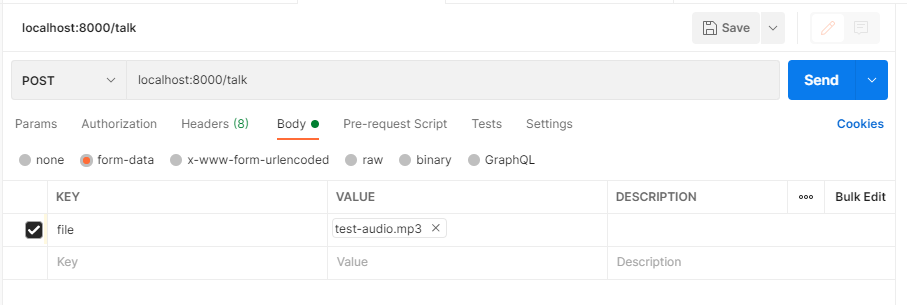

# ChatGPT Interview Bot

Tutorial from Travis Media.  
https://www.youtube.com/watch?v=4y1a4syMJHM
This application creates an interview bot that can response with audio to our questions that we also ask via audio.  

Workflow of the app:
- submit audio
- have the audio be decoded to text by ChatGPT's Whisper model
- the text, along with system context, is submitted as a message to ChatGPT as a user such that we can get a ChatGPT assistant response. 
- We take the response from ChatGPT, and feed it to ElevenLabs API which uses AI to generate voice from text.
- We then save the audio output from ElevenLabs, and play it back to hear the assistants response.

Each text-to-spech request to OpenAI currently costs $0.01 as of 2023-11-19.

# How to use this application 

* Install dependencies: 
```
pip install fastapi
pip install uvicorn
pip install openai
pip install python-dotenv
pip install python-multipart
pip install requests
```
* set up an OpenAI Account and pay for some credits in the billing tab:  
> platform.openai.com  
> manage account 
* set up your OpenAI Environment variables in `.env`. See `.env.sample` to get the structure of the `.env` file. 
* Create an ElevenLabs account and go to `profile` to get your API key:  
> https://elevenlabs.io/  
and update the `.env` file.
* Record audio with https://online-voice-recorder.com/
* Save it as a file in audio-files
* You can clear the contents of `database.json` if you want a fresh start for the conversation.
* Start up the FastAPI server with `uvicorn main:app`

* Use Postman to send a POST `/talk` request:


```
POST
localhost:8000/talk
form data: file
KEY: file
VALUE: test-audio.mp3
```

* Take the audio response from Postman and save it to a file, play back the response, and record a new audio file in response.  
